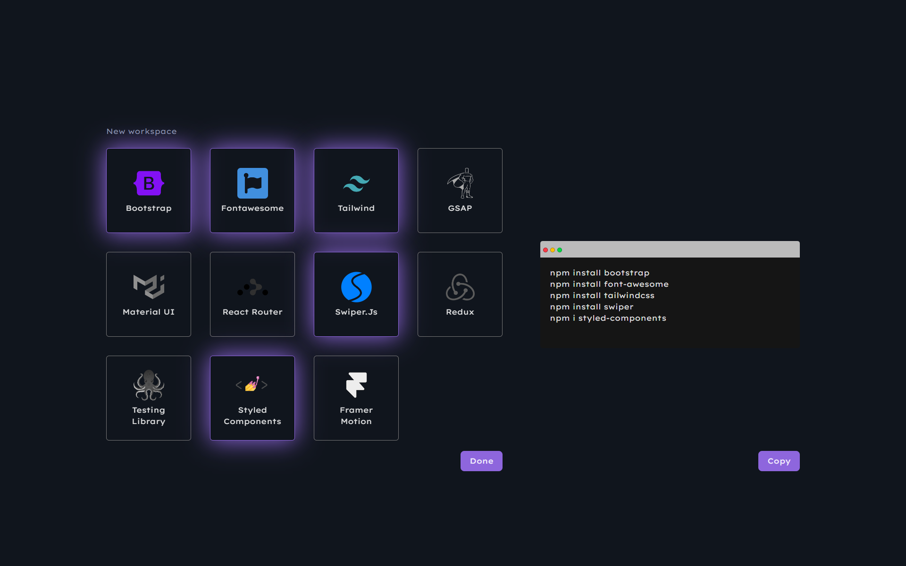

# IDX Project

Add your libraries easily and start your project immediately

## How to use:

1. Click "Get Started."
2. Select the libraries you want.
3. Click "Done."
4. On the right, you will receive the commands in the terminal.
5. Copy the lines by clicking "Copy."
6. Finally, paste them into your terminal in your project, and now you're ready to work!

